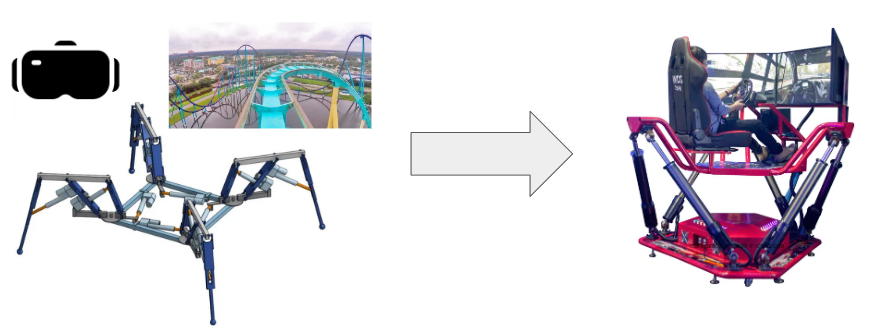
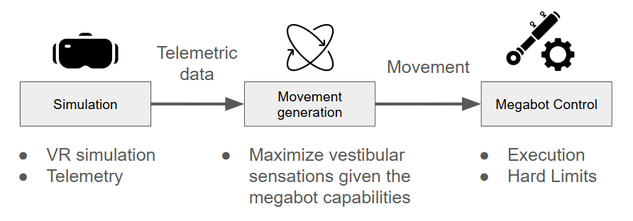
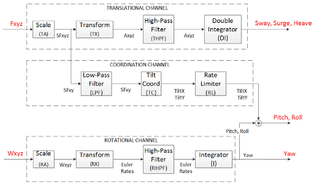
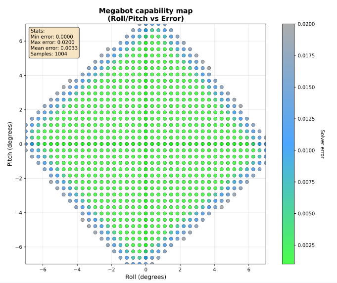

# 📖 Report

## ⁉️ Specifications

This project's goal is to create a fun and unique way of showcasing the full megabot capabilities during a live presentation. A VR roller coaster simulation is the chosen type of experiment as it is both accessible and stimulating. The Megabot is used to create a motion simulation rig responding to the inputs provided by the game.

The VR roller coaster experience is provided by Epic Roller Coaster on a Quest 2 VR headset. [Placo](https://github.com/Rhoban/placo) is the solver used to control the robot, the inverse kinematic is approximated due to the complexity of its calculation.

## 🔎 Implemented approach
To add our feature to the Megabot we worked with the current python code from Julien Allali on the Rhoban private repository. We added our program in the task management code so it can be used with the current interface.

This project can be divided into 3 distinct steps :

### VR simulation & Telemetric Data
The megabot integrated computer is not equipped with a graphical processor or the neccesary raw processing power to run a VR simulation. Therefore the VR simulation either had to be pre-rendered (as 360 VR video) or the simulation had to be hosted elsewhere. The latter was chosen has it allows for greater flexibility.

[Epic Roller Coaster](https://www.meta.com/fr-fr/experiences/epic-roller-coasters/2299465166734471/?srsltid=AfmBOooYAg3bSk0AZG8ef1if2T0tZa2494rjvPgOzdmnDo_wUUfML9jl) is the VR simulator used and available on the Quest 2 VR headset. It is able to broadcoast the telemetric data through the local network. This requires that the VR headset and the Megabot are connected to the same local network. The broadcast can be setup to be sent to any local address in the network. The onboard program on the Megabot then reads and interprets the broadcasted data to feed it in the motion algorithm.

### Movement Generation
Once the telemetric data about the virtual wagon's angular velocity and linear acceleration has been gathered from the simulation, the information is fed to a classical washout algorithm tuned for the megabot. The name washout comes from the fact that it "washes" out all sustained movement to only keep the most sudden ones. This method is based on studies on the human motion perception and how higher frequency movements are better perceived than low ones.

A classic washout algorithm can be decomposed into three distinct channels. The source code can be found in [washout_algorithm.py](../../src/washout_algorithm.py).

- **The translational channel** : Takes the linear acceleration as input, applies a high pass filter and integrates twice the acceleration to get a position. This position is then set as the target position of the megabot central platform. In this manner only the most sudden acceleration are mimicked by the megabot's platform

- **The tilt coordination channel** : Also takes the linear acceleration but applies a low pass filter. Then it goes through a tilt coordinate calculation, which is calculated as the arcsinus of the linear acceleration components divided by the gravity acceleration scalar. The angles given as output are added to the rotation of the megabot's central platform. This allows the sustained accelerations to be simulated using gravity according to the body's perception of movement.

- **The rotational channel**: Takes the angular velocity as input, applies a high pass filter and integrates the velocity to get an angular position. The angular position is then set as the target for the angular position of the megabot. This is applied to roll and pitch only as yaw is not replicated by the megabot to allow for a wider space of positions.

### Limits and Robot control
Limits and boundaries are applied right after to the algoritm's output to verify and correct the generated movement before sending it to the already existing megabot control codebase to command the megabot. To seek out the limits, a cartography of the megabot reachable position has been done.

A separate program was also written, [cartography.py](../../src/cartography.py), to map the capabilities of the megabot along its 6 degrees of freedom and determine the limits and optimal positions.

In order to stay within reachable space, both angular and linear positions are clamped within a diamond shape (to reflect the shape of the diagram above). The megabot's initial height in dance setup is configured to be the position offering the broadest range of movement. A sweep of multiple possible heights determined that the dance setup was the most optimal.

Angular and linear speeds are also limited to better reflect the physical constraint of the megabot with its digital twin, as the digital twin does not take into account the actuators' max speed. Limits on velocities are also a way to ensure the safety of the user.

## 📈 Feedback

Although the end product of this project has been tested and enjoyed by multiple people, their feedback hasn't be measured and quantified in a formal manner.

Overall The feedback has been rather positive. But a more rigorous study is needed to conclude on the validity of our solution. From a subjective standpoint it definitly showcases the capabilities of the Megabot both to the person experiencing the ride and to the people around it. All the safety measures and the tuning also allows the experience although striking, to not be scary.

As of right now, the tuning of the parameters of the movement generation can still be improved and are rather conservative.
